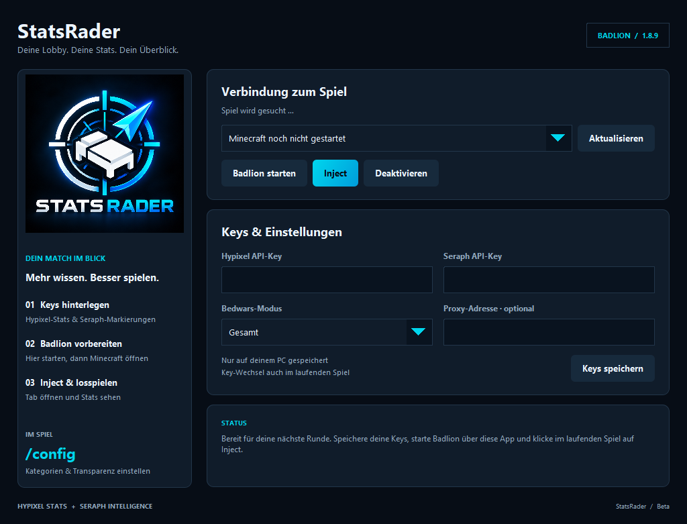

  
  <h1>StatsRader</h1>
  
Deine Lobby. Deine Stats. Dein Überblick.

  
Bedwars-Statistiken direkt in der Minecraft-Spielerliste.

## Download

Die portable **StatsRader-Portable.exe** findest du unter [Releases](https://github.com/CeliacCompass/StatsRader/releases).
Nur eine Datei – Java ist enthalten. Windows 10/11 mit 64 Bit, Badlion und Minecraft **1.8.9** werden benötigt.

Zum Benutzen brauchst du nur die EXE aus Releases. Die Ordner hier enthalten Quellcode, Tests, Grafiken und Build-Werkzeuge für die Entwicklung. `Start-StatsRader.cmd` ist der lokale Starter nach einem eigenen Build.

## Funktionen

- Geordnete Tab-Tabelle mit Tag/Sternen, Name, FKDR, BBLR, WLR, Wins und weiteren auswählbaren Statistiken.
- Individuelle Farbstufen für die Statistikwerte; Urchin-Tags und serverseitige HP/Score-Werte ganz rechts.
- **`/config`** für Statistikspalten und Hintergrundtransparenz.
- Automatisches **`/who`** beim erkannten Bedwars-Rundenstart.
- Maskierte API-Key-Felder und Key-Wechsel während des Spiels.
- **Inject** und **Deaktivieren** für eine vorbereitete Spielsitzung.
- Optionale zusätzliche Hypixel-Serveradressen für verwendete Proxys.

## Schnellstart

1. EXE herunterladen und öffnen.
2. Eigene Hypixel- und Urchin-API-Keys eintragen und **Keys speichern** anklicken. Ein alter Seraph-Key ist kein Urchin-Key und wird nicht übernommen.
3. Minecraft und Badlion vollständig schließen, einschließlich des Symbols im Infobereich.
4. In StatsRader **Badlion starten** anklicken, anschließend Minecraft **1.8.9** öffnen.
5. In StatsRader **Inject** anklicken und auf Hypixel die Spielerliste mit **Tab** öffnen.
6. Mit **`/config`** die Anzeige anpassen.

Starte Badlion auch bei späteren Sitzungen über StatsRader. Ein normal gestartetes Badlion kann Java-Attach sperren; in diesem Fall ist der vorbereitete Neustart erforderlich. StatsRader deaktiviert diese JVM-Sperre nicht. Neue App-Versionen benötigen ebenfalls einen vollständigen Spielneustart.

## API-Keys und lokale Daten

**Im Download und im Quellcode sind keine persönlichen API-Keys enthalten.** Jeder verwendet eigene Zugänge. Abgelaufene Keys können in der App ersetzt werden.

Einstellungen liegen unter `%LOCALAPPDATA%\BedwarsTab\settings.properties`, entpackte App-Versionen unter `%LOCALAPPDATA%\BedwarsTab\app`. Die Keys sind im Eingabefeld maskiert, in der lokalen Einstellungsdatei jedoch im Klartext gespeichert. Diese Datei und eigene Logs nicht hochladen oder weitergeben.

Hypixel-Keys werden für Statistikabfragen an Hypixel verwendet. Urchin-Abfragen verwenden die dokumentierte Player-API mit `sources=GAME`; die API liefert Tags zum Spieler. Ein Tag ist eine Anbieter-Markierung und kein eigenständiger Beweis für Cheating. Die Urchin-Anbindung nutzt die [offizielle Urchin-API](https://docs.urchin.ws/).

## Status

Experimentelle Beta für Badlion 1.8.9. Die automatisierten Funktions- und Pakettests sind bestanden; Client-Updates können die Integration verändern. Ein vollständiger Test der portablen Ausgabe auf einem zweiten Badlion-PC steht noch aus.

Die EXE ist noch nicht digital signiert. Zu jedem Download gehört eine SHA-256-Datei zum Prüfsummenvergleich.

## Entwicklung

Build, Voraussetzungen und Tests: [docs/BUILD.md](docs/BUILD.md).
Drittanbieter-Komponenten: [packaging/THIRD-PARTY.txt](packaging/THIRD-PARTY.txt).

Badlion-, Minecraft- und OptiFine-Clientdateien werden nicht mitgeliefert. StatsRader ist kein offizielles Produkt von Badlion, Hypixel, Mojang, Urchin oder Seraph.
